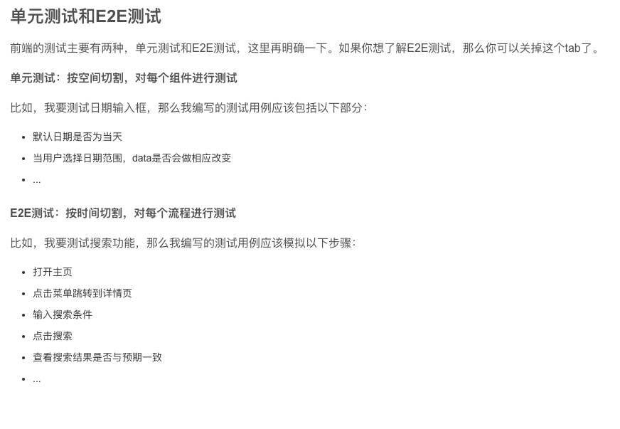
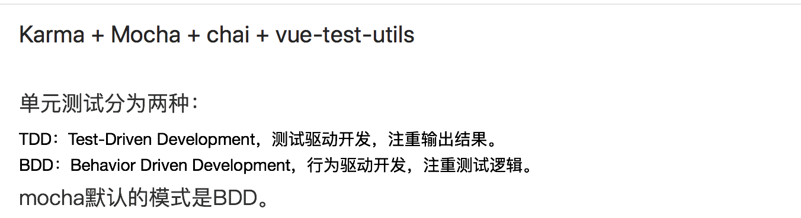

## 前端测试分类
[参考文档](https://www.jianshu.com/p/c817249616ee)

### 测试的好处
减少bug、
提高代码质量、
快速定位问题，减少调试时间、
放心重构。

### 前端测试分类
- 1-单元测试(Unit Test)
- 2-集成测试(Integration Test)
- 3-端到端测试(End-to-End Test)

### 单元测试与e2e测试主要侧重点

### 单元测试BDD与TDD
